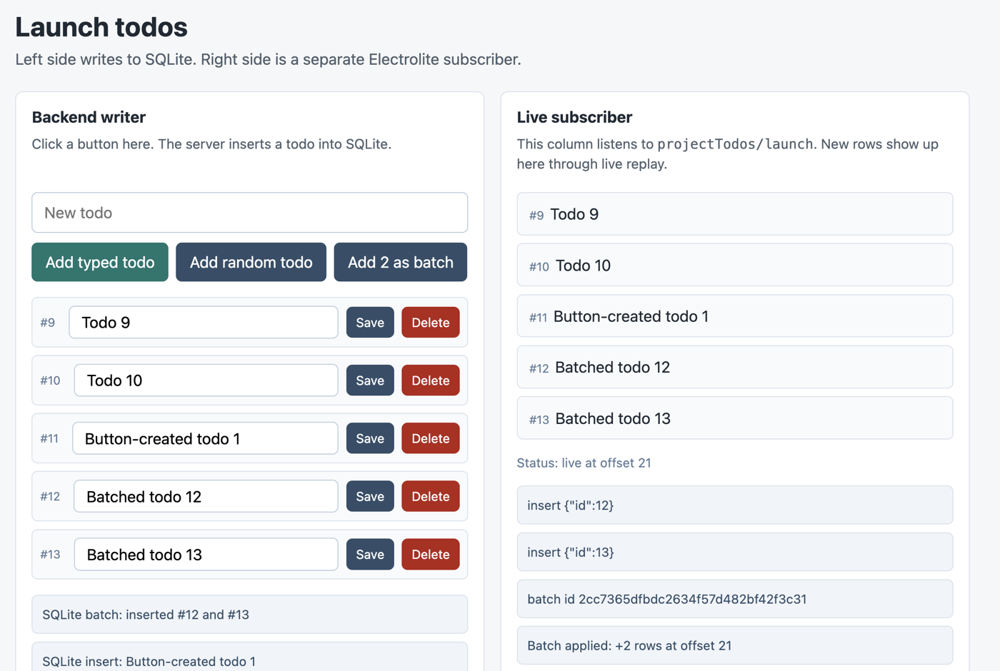

# electrolite

Electric-style sync for SQLite apps, embeddable in your app.

Electrolite lets your app say: this browser is allowed to see this slice of SQLite rows, so send the rows now and keep them updated when SQLite changes.

Example: a user opens project `p1`. The browser should see todos where
`project_id = "p1"`. If another request inserts, updates, moves, or
deletes one of those todos, the browser should update without a full page
refresh.

That is the basic [ElectricSQL](https://electric-sql.com/) idea, but for
SQLite. Electric's [Electric Sync](https://electric.ax/docs/sync/) does
this for Postgres. It exposes selected subsets of database rows called
Shapes, sends an initial snapshot, then sends live logical changes.

Electrolite does the SQLite version inside your TypeScript app using
SQLite triggers, a durable change log, and an ordinary HTTP endpoint. The
backend runs in plain Node using Node's built-in SQLite API. There is no
native build, sidecar, npm install step, or separate sync service.

> **Experimental software.**

SQLite becomes a live backend for browser state without letting the
browser send SQL. Auth stays in your app, the sync endpoint is just a
normal `Request -> Response` handler, and the code is small enough to
read.

## Tiny Example

You define a server-owned row set:

```ts
projectTodos: shape({
  table: "todos",
  columns: ["id", "project_id", "title", "done"],
  params: ["projectId"],
  where: ({ params }) => eq("project_id", params.projectId),
  authorize: ({ params, context }) => {
    return context.user.projects.has(params.projectId);
  },
})
```

Then a browser can subscribe to:

```text
/electrolite/v1/projectTodos/p1
```

Meaning:

```text
Give me todos for project p1, if this user is allowed to see p1.
Then keep me updated.
```

## Try It

Electrolite is not published to npm yet. For now, the easiest path is to
use this repository directly. You need Node 24 or newer.

```sh
git clone https://github.com/russellromney/electrolite.git
cd electrolite
npm run demo:web
```

Open `http://localhost:3000`. The left side writes todos to SQLite; the
right side is a live Electrolite subscriber. Add, rename, delete, and
batch-write todos to watch the Shape update.



## What Works Now

- Server-defined Shapes with app-owned authorization.
- Initial snapshots plus `live=true` long-polling.
- Inserts, updates, deletes, primary-key changes, and explicit batches.
- Durable `log_id` and `shape_handle` validation for browser caches.
- Browser IndexedDB persistence, replay draining, retry, and multi-tab
  coordination.
- Key-column metadata, composite primary keys, retained-log resync, and
  schema-normalized predicates.

## What Is A Shape?

Electrolite exposes selected subsets of database rows called Shapes.

A Shape is just:

```text
table + columns + filter + auth scope
```

Example Shapes:

- todos for one project
- photos owned by one user
- events for one account
- likes on photos this user may see

In Electrolite today, a Shape is server-defined and contains:

- a source table
- a column allowlist
- a predicate, currently equality, `IN`, and conjunctions
- an authorization scope
- a schema version

Browsers do not send arbitrary SQL. They request named Shapes that the
host application has already defined and authorized.

That is the point. The browser can say "I want `projectTodos/p1`." It
cannot say "run this SQL I made up."

Applications can also register dynamic, server-owned Shape routes such
as `/projects/:project_id/todos`. The route turns request path/auth
context into a concrete Shape, and the normal authorizer checks the
generated authorization scope before SQLite is touched.

## Use It Before npm

Until packages are published, treat Electrolite like a vendored library:

1. Add this repository to your app as a git submodule, subtree, or copied
   `vendor/electrolite` folder.
2. Import the TypeScript-facing backend API by path:

```ts
import {
  createElectrolite,
  eq,
  shape,
} from "./vendor/electrolite/packages/electrolite-node/electrolite-node.ts";
```

3. Serve the browser client from your app, or copy
   `clients/browser/electrolite.js` into your frontend bundle.

The examples in this repo use the same path-import setup. There is no
registry account, install token, or sidecar service involved.

Electrolite uses Node's built-in SQLite engine:

```ts
const electrolite = createElectrolite({ dbPath: "./app.db" });
```

Run the main test suite:

```sh
npm test
```

Run every package test:

```sh
npm run test:all
```

## TypeScript Quick Start

Backend:

```ts
import {
  createElectrolite,
  eq,
  shape,
} from "./vendor/electrolite/packages/electrolite-node/electrolite-node.ts";

const electrolite = createElectrolite<{ user: { projects: Set<string> } }>({
  dbPath: "./app.db",
  shapes: {
    projectTodos: shape({
      table: "todos",
      columns: ["id", "project_id", "title", "done"],
      params: ["projectId"],
      where: ({ params }) => eq("project_id", params.projectId),
      scope: ({ params }) => `project:${params.projectId}`,
      authorize: ({ params, context }) => {
        return context.user.projects.has(params.projectId);
      },
    }),
  },
});

electrolite.executeBatch(`
  CREATE TABLE IF NOT EXISTS todos (
    id INTEGER PRIMARY KEY,
    project_id TEXT NOT NULL,
    title TEXT NOT NULL,
    done BOOLEAN NOT NULL DEFAULT 0
  );
`);
electrolite.installTriggers("todos");

export async function GET(request: Request) {
  const session = await getSession(request);
  return electrolite.handle(request, {
    user: { projects: await projectsForUser(session.userId) },
  });
}
```

Browser:

```ts
import { ShapeClient } from "./vendor/electrolite/clients/browser/electrolite.js";

const todos = new ShapeClient("/electrolite/v1/projectTodos/project-123");

todos.subscribe((rows) => {
  renderTodos(rows);
});

todos.start();
```

What happens:

1. Browser asks for `/electrolite/v1/projectTodos/project-123?offset=-1`.
2. Your TypeScript app checks the user can see `project-123`.
3. Electrolite returns the current matching rows.
4. Browser asks again with the returned offset and `live=true`.
5. When matching SQLite rows change, the browser receives the change.

Under the hood, Electrolite installs SQLite triggers, records a durable
logical change log, normalizes Shape handles against the SQLite schema,
and uses replay boundaries so browsers do not publish half-applied
batches.

You do not need to run a separate sync service for this path.

## Workspace

- `packages/electrolite-node` - TypeScript-friendly embedded backend
  package using Node's built-in SQLite API.
- `clients/browser` - dependency-free browser materializer for Shape
  snapshots and live replay messages.

## Goals

- Electric-like initial snapshot plus live offset replay for SQLite.
- Named server-side Shapes instead of arbitrary browser SQL.
- Browser delivery over cache-friendly HTTP long-polling.
- Strong security defaults: app-authorized Shapes, column allowlists, and
  private raw logs.
- Good enough fanout for small and medium apps first. Shared team,
  workspace, and document Shapes should be cheap. Huge per-user-private
  fanout can come later.

## Fanout Smoke Test

The fanout demo starts many in-process browser clients against the
embedded handler, puts them all into a live wait, performs one SQLite
write, and checks that every client materializes the new row.

```sh
npm run demo:fanout
ELECTROLITE_FANOUT_CLIENTS=1000 npm run demo:fanout
```

On one local run, a single SQLite write woke `1000/1000` live Shape
clients and all 1000 materialized the new row in about `100ms`. This is a
smoke test, not a network benchmark.

## Future Direction

- React hooks and tiny framework examples.
- Benchmark numbers for snapshot, replay, and live fanout.
- Shape diagnostics that explain predicates, key columns, trigger status,
  and suggested SQLite indexes.
- Retention auto-compaction with safe defaults.
- Better fanout for shared Shapes through wait coalescing and cacheable
  response chunks.
- Optional object-storage mode for immutable authorized Shape chunks.
- Offline writes and conflict handling as a separate later track.

## Non-goals

- Postgres replication.
- Arbitrary client-provided SQL.
- Offline writes or conflict resolution in the first version.
- A required standalone sync daemon.

## Roadmap

See [ROADMAP.md](ROADMAP.md).
Completed work is tracked in [CHANGELOG.md](CHANGELOG.md).

For the user-facing TypeScript API, start with
[packages/electrolite-node/README.md](packages/electrolite-node/README.md).

## Status

This is still early, but the main TypeScript path works end to end:

- embedded Node package
- TypeScript engine using Node's built-in SQLite API
- SQLite trigger install
- initial snapshots
- bounded replay
- `live=true` long-polling
- app-owned authorization
- retained-log `409 resync_required`
- durable `log_id` validation so cached browser offsets cannot be reused
  against a different SQLite log history
- durable `shape_handle` validation so cached browser rows cannot be
  reused after a Shape definition changes
- key-column metadata for the browser
- schema-normalized Shape handles
- targeted live wakeups for affected Shapes
- browser IndexedDB persistence
- browser multi-tab coordination
- browser replay draining before live long-polling
- low-level browser replay events
- replay messages include `batch_id` for real batch grouping
- explicit TypeScript write batches for consistency boundaries
- E2E tests for the browser/client/backend flow
- basic real web app example

Still rough:

- not on npm yet
- no React hooks yet
- predicate language is small on purpose
- no offline writes or conflict resolution
- no required sidecar mode
